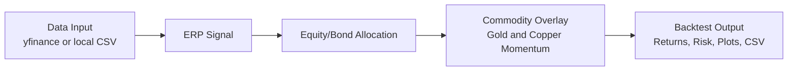
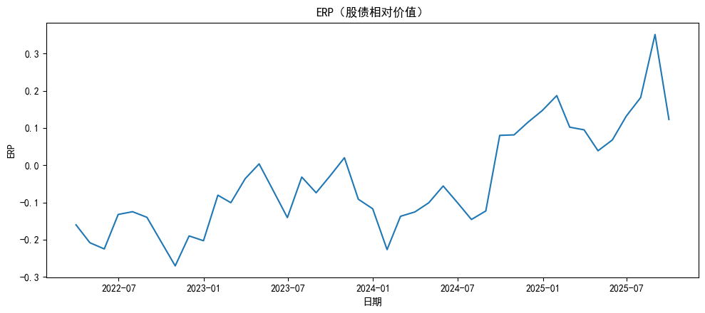
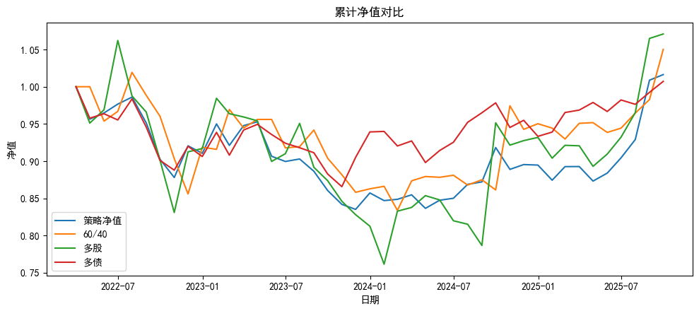
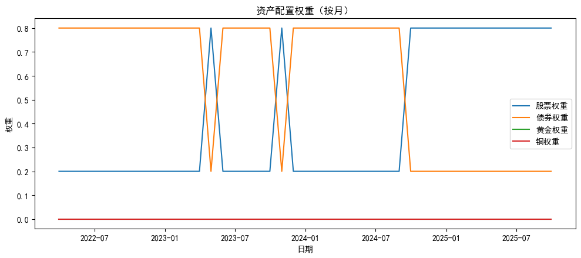

<h1 align="center">中国市场大类资产配置策略研究 | Asset Allocation Strategy for the Chinese Market from a Global Perspective</h1>

<hr/>

<p align="center">
  <a href="#简体中文">
    
  </a>
  <a href="#english">
    
  </a>
</p>

---

## 简体中文

### 1. Project Overview

这是一个关于中国市场大类资产配置的研究型项目。核心框架为 ERP（股债风险溢价）阈值驱动的股债切换，并在此基础上加入黄金与铜的时序动量增强。项目目标是在可复现、可执行的规则下提升风险调整收益，并与纯股、纯债、60/40 等基准进行系统对比。

### 策略框架图



### Results Snapshot

| Metric                | Definition |
| --------------------- | ---------- |
| Annualized Return     | 年化收益率 |
| Annualized Volatility | 年化波动率 |
| Sharpe Ratio          | 夏普比率   |
| Max Drawdown          | 最大回撤   |

注：具体数值请以最新回测输出为准（见 `outputs/strategy_timeseries.csv` 与回测终端打印）。

### 2. Research Motivation

- 传统美林时钟框架相对低频，难以直接满足高频配置决策需求。
- 中国市场的股债轮动与全球宏观错位更复杂，静态框架解释力有限。
- 因此需要一个高频、可执行、可复现的资产配置研究框架。

### 3. Methodology

- ERP 三种定义：
  - `ret_minus_yield`：股市过去 N 个月收益率减债券收益率
  - `ep`：盈利收益率（E/P）减债券收益率
  - `divgrow`：股息率加增长率减债券收益率
- 信号频率：月频；执行方式：当月月末生成信号，次月执行。
- 核心切换规则：
  - ERP > 阈值：股票/债券 = 80/20
  - ERP <= 阈值：股票/债券 = 20/80
- 动量叠加：黄金和铜动量为正时，各自最多叠加 10% 权重。
- **No Look-Ahead Bias**：权重使用滞后一期执行（`shift(1)`），避免前视偏差。

### 4. Backtest Design

- 数据频率：日频数据输入，统一重采样到月末（daily -> month-end）。
- 基准组合：all equity、all bond、60/40。
- 评价指标：annual return、annual volatility、Sharpe ratio、max drawdown。
- 交易成本假设：当前基线版本默认 0 bps（未显式建模），作为后续扩展项。

### 5. Key Results

#### ERP 序列图



#### 累计净值图



#### 权重变化图



### 6. Repository Structure

```text
.
|-- data/                                # 输入数据（离线模式）
|-- figures/                             # 图表输出
|-- outputs/                             # 回测时序输出
|-- Asset Allocation Backtesting.ipynb   # 研究笔记本
|-- Asset_Allocation_Backtesting.py      # 核心回测脚本
|-- README.md
|-- LICENSE
|-- references.bib
|-- strategy_table.tex
`-- 全球视野下中国市场大类资产配置策略：基于股债性价比的研究框架.tex
```

### 7. How to Run

1. 安装依赖

```bash
pip install -U pandas numpy matplotlib yfinance ipython
```

2. 准备数据

- 在线模式：`USE_YF = True`，直接使用 yfinance。
- 离线模式：`USE_YF = False`，在 `data/` 中准备 `equity.csv`、`bond.csv`（可选 `gold.csv`、`copper.csv`、`ep.csv`、`dividend_yield.csv`）。

3. 运行脚本或 Notebook

```bash
python Asset_Allocation_Backtesting.py
```

或打开 `Asset Allocation Backtesting.ipynb` 按顺序执行。

### 8. Future Improvements

- Multi-ERP ensemble（多 ERP 组合信号）
- Dynamic threshold calibration（动态阈值校准）
- Transaction cost modeling（交易成本建模）
- Cross-market extension to HK/US assets（扩展到港股/美股资产）

### 数据管道复现性

- 在线管道：`yfinance` 自动抓取，便于快速实验。
- 离线管道：本地 CSV 输入，便于审计、复现与脱网环境运行。

### License

本项目采用 MIT License，详见 `LICENSE`。

---

## English

### 1. Project Overview

This project studies China-focused multi-asset allocation with an ERP-threshold switching framework between equity and bond, enhanced by optional gold/copper momentum overlays. The objective is to improve risk-adjusted returns and benchmark against all-equity, all-bond, and 60/40 portfolios.

### 2. Research Motivation

- Traditional macro-clock frameworks are relatively low frequency.
- China asset rotation and global macro divergence are structurally complex.
- A higher-frequency, executable, and reproducible framework is needed.

### 3. Methodology

- Three ERP definitions: `ret_minus_yield`, `ep`, `divgrow`.
- Monthly signal and next-month execution.
- Allocation rule: ERP > threshold -> 80/20, else 20/80.
- Commodity overlay: add up to 10% each for gold/copper when momentum > 0.
- **No Look-Ahead Bias** via lagged execution (`shift(1)`).

### 4. Backtest Design

- Data frequency: daily input, month-end resampling.
- Benchmarks: all equity, all bond, 60/40.
- Metrics: annual return, annual volatility, Sharpe ratio, max drawdown.
- Transaction cost assumption: baseline version uses 0 bps.

### 5. Key Results

- ERP series: `erp_series.png`
- Cumulative returns: `cumulative_returns.png`
- Allocation weights: `weights.png`

### 6. Repository Structure

- `data/`, `figures/`, `outputs/`
- `Asset_Allocation_Backtesting.py`
- `Asset Allocation Backtesting.ipynb`
- `README.md`, `LICENSE`

### 7. How to Run

1. Install dependencies.
2. Prepare online or offline data.
3. Run script or notebook.

```bash
python Asset_Allocation_Backtesting.py
```

### 8. Future Improvements

- Multi-ERP ensemble
- Dynamic threshold calibration
- Transaction cost modeling
- HK/US cross-market extension

### License

This project is licensed under the MIT License. See `LICENSE` for details.
