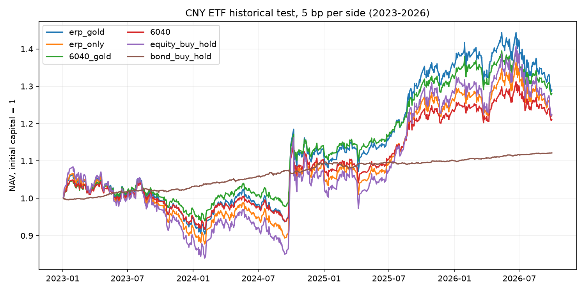

# 中国人民币资产配置研究

2026-10-04 已修复数据口径、信号时点和收益记账。**旧论文及旧图表的绩效结论撤回**；当前唯一有效输出是 `outputs/validated_20260930/`。

当前实验使用人民币沪深300、国债和黄金ETF，真实 E/P 减10年国债收益率，120个交易日黄金动量，月末决策、次日开盘成交。以2023年前数据确定阈值，固定参数检查2023-01-03至2026-09-30。

| 组合（单边5bp） | 年化收益 | 夏普 | 最大回撤 |
|---|---:|---:|---:|
| ERP + 黄金 | 7.32% | 0.60 | 14.93% |
| 60/40 + 黄金 | 7.09% | 0.73 | 10.43% |
| 60/40 | 5.46% | 0.56 | 12.67% |

**尚无ERP择时有效的证据**：测试期45次决策全部维持高股票仓位，净值与固定80/20加同样黄金规则完全一致。相对60/40加黄金的风险调整表现更差。此次改动不是把收益调高，而是让数据、时点、基准和结论能够逐项复核。



## 复现

```bash
python -m pip install -r requirements.txt
python Asset_Allocation_Backtesting.py
python -m pytest tests -q
```

默认读取已有本地快照，无网络调用。原始快照留在本地并由 Git 忽略，仓库只发布来源清单及研究输出；从远程新克隆后，需先设置自己的 `TUSHARE_TOKEN` 并运行 `python refresh_data.py` 获取来源，再执行离线回测。该脚本复用已有快照，不覆盖原始行情；固定数据截止日为2026-09-30。

- [修复原因、完整结论和限制](RESEARCH_REPAIR.md)
- [数据来源](data/validated_20260930/manifest.json)
- [完整基准与费用敏感性](outputs/validated_20260930/metrics.csv)
- [月末决策及来源日期](outputs/validated_20260930/decisions.csv)
- [执行假设](outputs/validated_20260930/assumptions.json)
- [独立验证记录](outputs/validated_20260930/validation_receipt.json)

历史数据版本未获时点认证，不能排除历史修订；这只是事后历史拆分。铜因缺少已验证的人民币可交易收益序列停用。整手约束、资金容量及订单成交未建模，结果不是实盘可执行性证明。

根目录旧 `strategy_timeseries.csv`、`outputs/strategy_timeseries.csv`、原PNG、HTML、Notebook、TeX/PDF均仅保留作历史证据。旧PDF未重编译。旧Python导出保存在 `legacy/`；请从上述当前入口复现。

## English

The former results are withdrawn because of mixed currencies, an invalid yield proxy, 120-month instead of 120-session momentum, and a one-month-lagged benchmark. The corrected offline experiment uses adjusted CNY ETFs, dated valuation/yield observations, next-open monthly rebalancing, drifting holdings and explicit transaction costs. The 2023–2026 historical test does **not** establish ERP timing alpha: every test decision remains equity-overweight. See the repair record and machine-readable ledgers above. Historical input vintages are not point-in-time certified.
